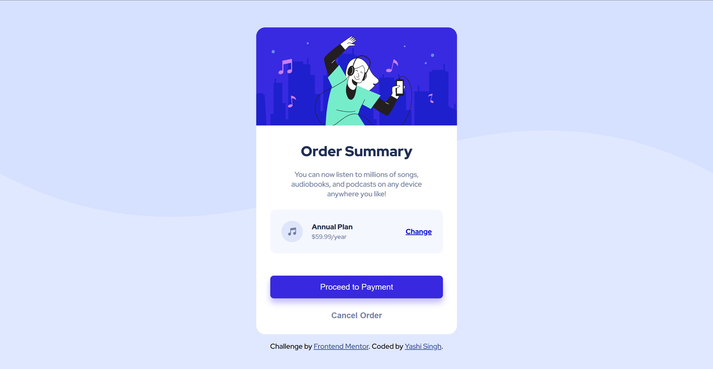

# Frontend Mentor - Order summary card solution

This is a solution to the [Order summary card challenge on Frontend Mentor](https://www.frontendmentor.io/challenges/order-summary-component-QlPmajDUj). Frontend Mentor challenges help you improve your coding skills by building realistic projects.

## Table of contents

- [Overview](#overview)
  - [The challenge](#the-challenge)
  - [Screenshot](#screenshot)
  - [Links](#links)
- [Style Guide](style-guide.md)
- [My process](#my-process)
  - [Built with](#built-with)
  - [What I learned](#what-i-learned)
  - [Useful resources](#useful-resources)
- [Contributing](#contributing)
- [Author](#author)
- [Acknowledgments](#acknowledgments)

## Overview

### The challenge

Users should be able to:

- View an order summary card with a background image.
- See the order details and plan options.
- Interact with hover states for the "Change" link and buttons.
- Adjust to different screen sizes with responsive design.

### Screenshot

### Links

- Solution URL: [Frontend Mentor Solution](https://www.frontendmentor.io/solutions/order-summary-component-Euhi2OlYk6)
- Live Site URL: [Order Summary Component Live](https://order-summary-component-solutions.netlify.app/)

## Style Guide

For details on the style guide used in this project, please refer to the [Style Guide](styleguide.md) file.

## My process

### Built with

- Semantic HTML5 markup
- CSS custom properties
- Flexbox
- CSS Grid
- Mobile-first workflow

### What I learned

Through this project, I improved my skills in creating responsive layouts and managing hover states. Using CSS custom properties made it easier to manage colors and themes across the site. 

### Useful resources

- [The Markdown Guide](https://www.markdownguide.org/) - A great resource for learning how to write effective markdown.
- [CSS Tricks: Flexbox Guide](https://css-tricks.com/snippets/css/a-guide-to-flexbox/) - A helpful guide on using Flexbox for layout design.

## Author

- LinkedIn - [Yashi Singh](https://www.linkedin.com/in/yashi-singh-b4143a246)
- Frontend Mentor - [@Yashi-Singh-1](https://www.frontendmentor.io/profile/Yashi-Singh-1)

## Acknowledgments

A special thanks to Frontend Mentor for the challenge and the community for the support and inspiration. This project was a great opportunity to practice and enhance my web development skills.
