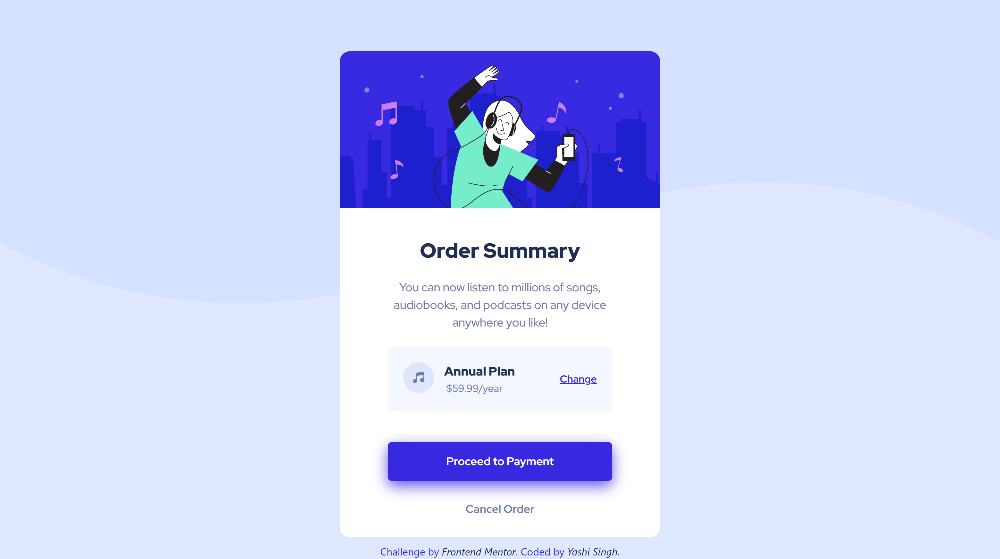

# Frontend Mentor - Order Summary Card Solution

  
  
  

This project is a solution to the [Order Summary Component Challenge](https://www.frontendmentor.io/challenges/order-summary-component-QlPmajDUj) on Frontend Mentor. Completing this challenge allowed me to sharpen my skills in responsive web design and component-based development using modern web tools.

---

## Table of Contents
- [Overview](#overview)
  - [The Challenge](#the-challenge)
  - [Screenshots](#screenshots)
  - [Live Links](#live-links)
- [Development Process](#development-process)
  - [Built With](#built-with)
  - [Key Learnings](#key-learnings)
  - [Useful Resources](#useful-resources)
- [How to Contribute](#how-to-contribute)
- [Author](#author)
- [Acknowledgments](#acknowledgments)

---

## Overview

### The Challenge

This project focuses on building a responsive order summary card component that allows users to:
- View a well-designed order summary card with clear details.
- Interact with hover states on buttons and links for a dynamic experience.
- Experience a responsive layout optimized for mobile and desktop screens.

---

### Screenshots

#### Desktop Design

#### Mobile Design

---

### Live Links

- **Solution URL**: [Frontend Mentor Solution](https://www.frontendmentor.io/solutions/order-summary-component-zmVI8t1PSm)  
- **Live Site**: [Order Summary Component Live](https://yashi-singh-9.github.io/Order-Summary-Component/)

---

## Development Process

### Built With
This solution was created using modern and scalable web development tools:
- **Semantic HTML5**: For structured and meaningful markup.
- **SCSS**: For maintainable and modular styles with variables, mixins, and nesting.
- **Bootstrap 5**: For faster UI development with a mobile-first approach.
- **Responsive Design**: Optimized for both desktop and mobile using SCSS media queries and Bootstrap utilities.

---

### Key Learnings

Through this challenge, I refined my ability to:
1. **Implement Responsive Design**: Ensuring the layout adapts seamlessly across various screen sizes.
2. **Use SCSS Efficiently**: Taking advantage of SCSS features such as variables for color management and mixins for reusable code.
3. **Combine Bootstrap and Custom Styles**: Leveraging Bootstrap utilities while maintaining the flexibility of custom SCSS styles.
4. **Hover and Interaction States**: Enhancing user experience with smooth hover effects for buttons and links.

---

### Useful Resources
- [Bootstrap Documentation](https://getbootstrap.com/docs/5.3/) - Essential for understanding and applying Bootstrap utilities and components.
- [SCSS Official Docs](https://sass-lang.com/documentation) - A great resource for mastering SCSS syntax and features.
- [CSS Tricks: A Complete Guide to SCSS](https://css-tricks.com/snippets/css/sass-guide/) - Helpful for improving SCSS workflow and organization.

---

## How to Contribute
If you'd like to contribute to this project:
1. Fork the repository.
2. Create a new branch (`git checkout -b feature-branch`).
3. Make your changes and commit them (`git commit -m "Add feature"`).
4. Push to the branch (`git push origin feature-branch`).
5. Open a pull request.

Please refer to the [CONTRIBUTING.md](CONTRIBUTING.md) file for detailed guidelines.

---

## Author

- **Name**: Yashi Singh  
- **LinkedIn**: [Yashi Singh](https://www.linkedin.com/in/yashi-singh-b4143a246)  
- **Frontend Mentor**: [@Yashi-Singh-9](https://www.frontendmentor.io/profile/Yashi-Singh-9)

---

## Acknowledgments

A big thank you to **Frontend Mentor** for providing this challenge and fostering a community that encourages learning and growth. I also want to express gratitude to the web development community for sharing resources and guidance.
